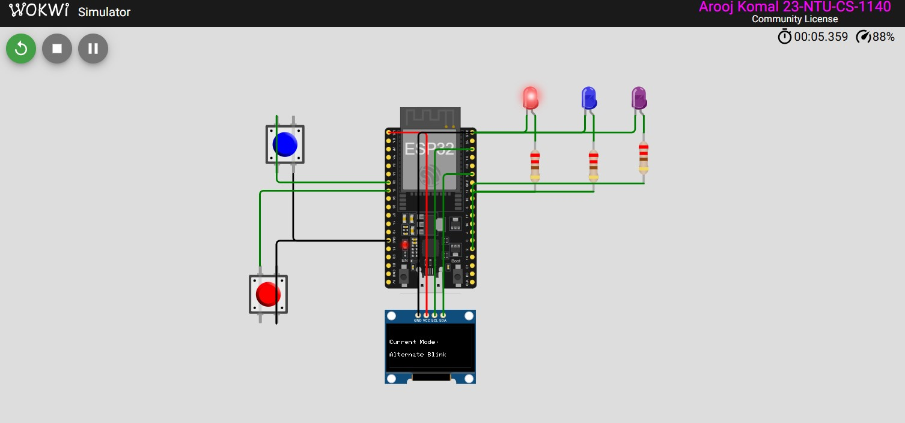
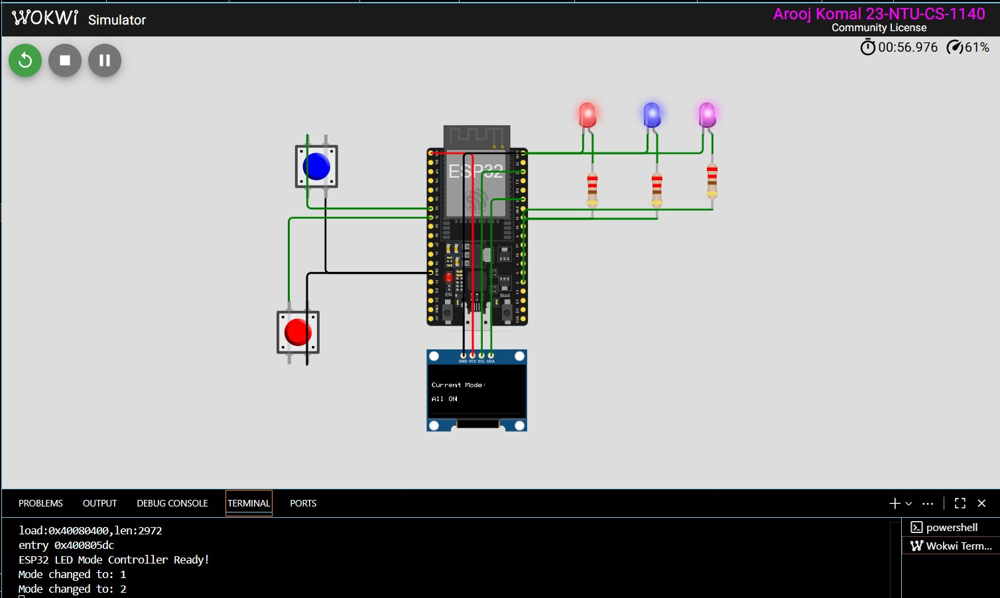
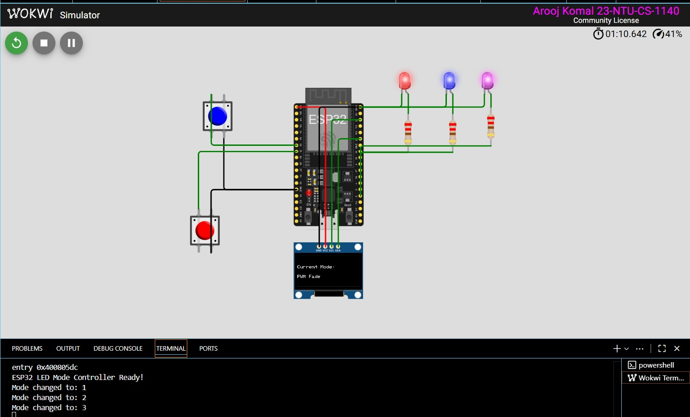
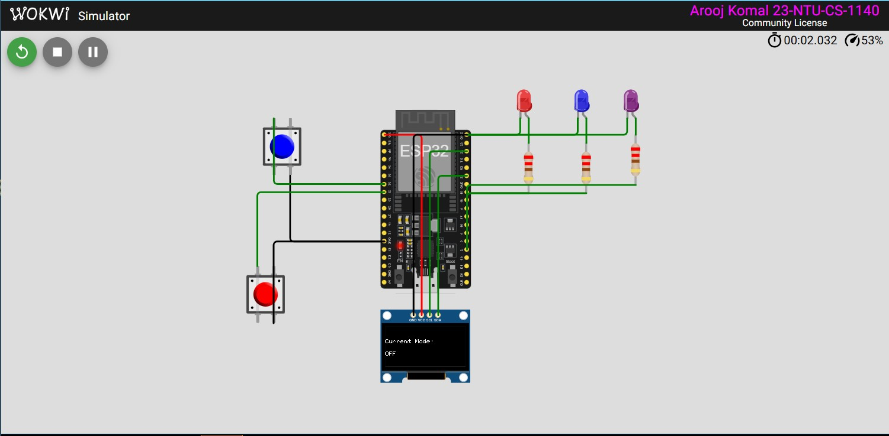

## Assignment 1 — ESP32 Multi-Mode LED Controller with OLED

**Student Name:** Arooj Komal  
**Reg. No:** 23-NTU-CS-1140  

---

## Project Overview

This project uses an ESP32, OLED display, two buttons, and three LEDs to demonstrate different lighting modes and display the current mode on the OLED screen.

###  Features
- **Mode Button (GPIO 32)** — cycles through LED modes (OFF → Alternate Blink → All ON → PWM Fade).  
- **Reset Button (GPIO 33)** — resets all LEDs to OFF mode.  
- **OLED Display (I²C: SDA=21, SCL=22)** — shows the **current LED mode** in real time.  
- **Serial Monitor** — prints mode change logs for debugging.

---

##  LED Modes

| Mode | Description            | OLED Message      |
|------|------------------------|-------------------|
| 0    | All LEDs OFF           | "OFF"             |
| 1    | LEDs blink alternately | "Alternate Blink" |
| 2    | All LEDs ON            | "All ON"          |
| 3    | Fading effect using PWM| "PWM Fade"        |

---

##  Pin Map

| Component     | ESP32 Pin | Description         |
|---------------|-----------|---------------------|
| Button (Mode) | GPIO 32   | Input (mode switch) |
| Button (Reset)| GPIO 33   | Input (reset)       |
| LED 1         | GPIO 2    | Output              |
| LED 2         | GPIO 4    | Output              |
| LED 3         | GPIO 18   | Output              |
| OLED SDA      | GPIO 21   | I²C Data            |
| OLED SCL      | GPIO 22   | I²C Clock           |

---

##  Components Used

- ESP32 (NodeMCU-32S)
- Push Buttons ×2  
- LEDs ×3 (with resistors)
- 0.96" OLED Display (I²C, 128×64)
- Breadboard and jumper wires

---

##  Wokwi Simulation

 **Wokwi Project Link:** [Click to view simulation](https://wokwi.com/projects/445888782551934977)

> Replace the link above with your actual Wokwi project link after exporting.

---

## Screenshots

| OLED Display | Circuit Simulation |
|---------------|--------------------|
|  |  |  | 

---

