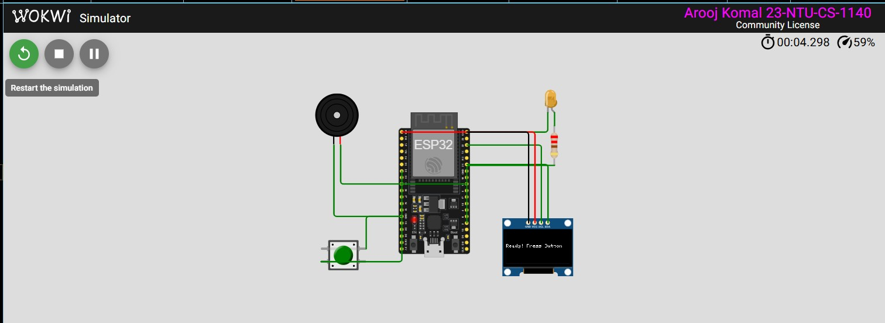
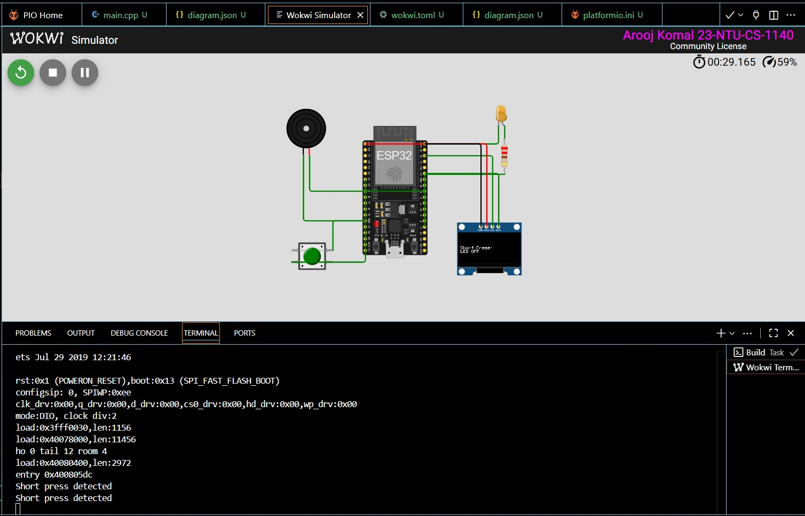
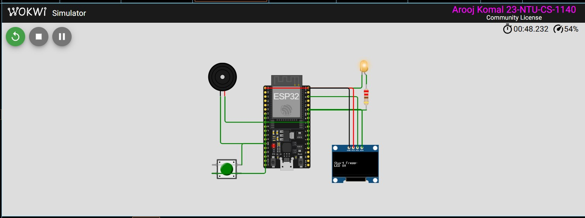
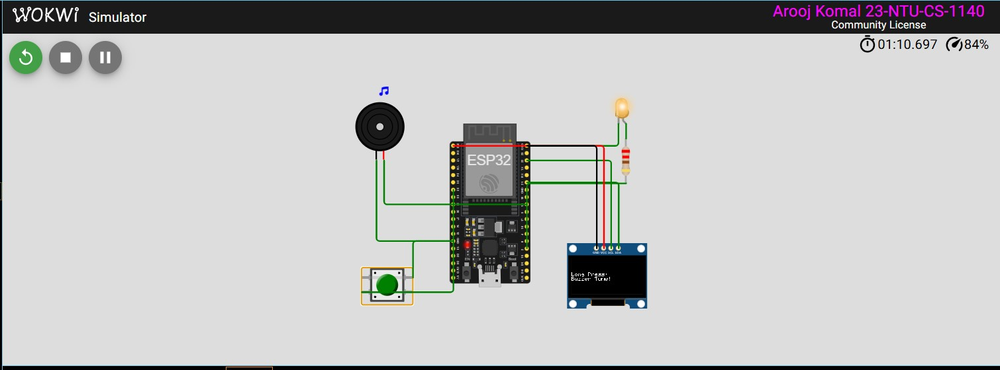

# Assignment 1 — ESP32 Button Press Detection
**Student:** Arooj Komal  
**Reg. No:** 23-NTU-CS-1140  

---

##  Project Overview
This project uses an ESP32, pushbutton, LED, buzzer, and OLED display to detect **short and long button presses**.

- **Short Press (<1.5s):** Toggles LED ON/OFF  
- **Long Press (≥1.5s):** Plays a buzzer tone  
- OLED displays the current action.

---

##  Pin Map

| Component      | ESP32 Pin  | Description          |
|----------------|------------|----------------------|
| Pushbutton     | GPIO 32    | Input (with pull-up) |
| LED            | GPIO 2     | Output               |
| Buzzer         | GPIO 18    | Output tone          |
| OLED (SDA/SCL) | 21 / 22    | I²C communication    |

---

##  Wokwi Project Link
 [Click here to view on Wokwi](https://wokwi.com/projects/445894197454780417)

---

##  Screenshots
| OLED Display | Simulation |
|---------------|-------------|
|  |  |  |  |

---
## Hand Drawn Diagram
|  |

